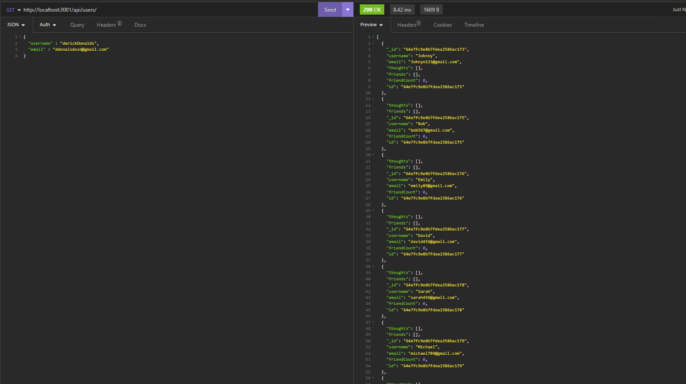

# Montechapi: Social Network API 
 
This project is an API for a social network web application where users can share their thoughts, react to friends' thoughts, and create a friend list. It utilizes Express.js for routing, MongoDB as the database, and the Mongoose ODM. The API provides various routes for performing CRUD operations on users, thoughts, reactions, and friend lists. 
 
## User Story
md
AS A social media startup
I WANT an API for my social network that uses a NoSQL database
SO THAT my website can handle large amounts of unstructured data

## Video Link 
 
Please refer to the following video for examples of the application's API routes being tested in Insomnia: 
https://watch.screencastify.com/v/n439MxR70jrZXEuzAvJ7

 
## Getting Started 
 
To set up the project, follow these steps: 
 
1. Make sure you have MongoDB installed on your machine. You can refer to the [MongoDB installation guide on The Full-Stack Blog](https://coding-boot-camp.github.io/full-stack/mongodb/how-to-install-mongodb) for instructions on how to install MongoDB locally. 
 
2. Clone this repository to your local machine. 
 found at https://github.com/WillZealot/MonTechApi
3. Install the necessary dependencies by running the following command in your terminal: 
 npm i
4. Make sure in the config file you are setting the name to your own mongodb database. then in the terminal enter node utils/seed.js. that shoudl seed then enter control c to get out of it.
5. in the terminal type nodemon and it should run start the server and you can then input http://localhost:3001 into insomnia or a webrowser just make sure you watch the video first to understand which routes to input.
 ## Usage
"Montechapi" serves as an api to create users, thoughts, reactions, and friends, as well as having routes to update delete those. Best use case would be for social networiking websites and apps.

## Technologies Used

JavaScript
MongoDb
Mongoose
Express.js

## Credits
William Tikhonenko

## Contributing
N/A

## Tests
None

## Licenses
None

## Questions
https://github.com/WillZealot
williamtikhonenko@gmail.com